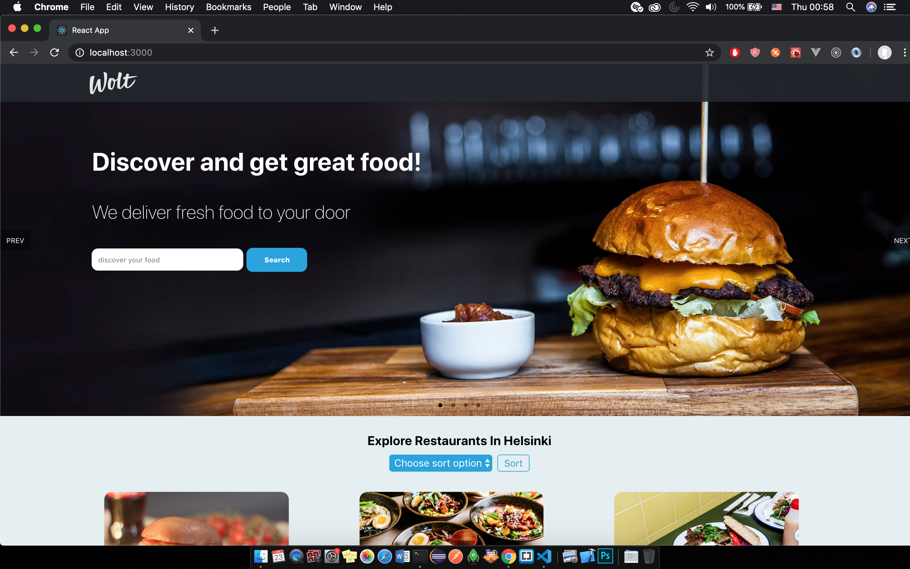
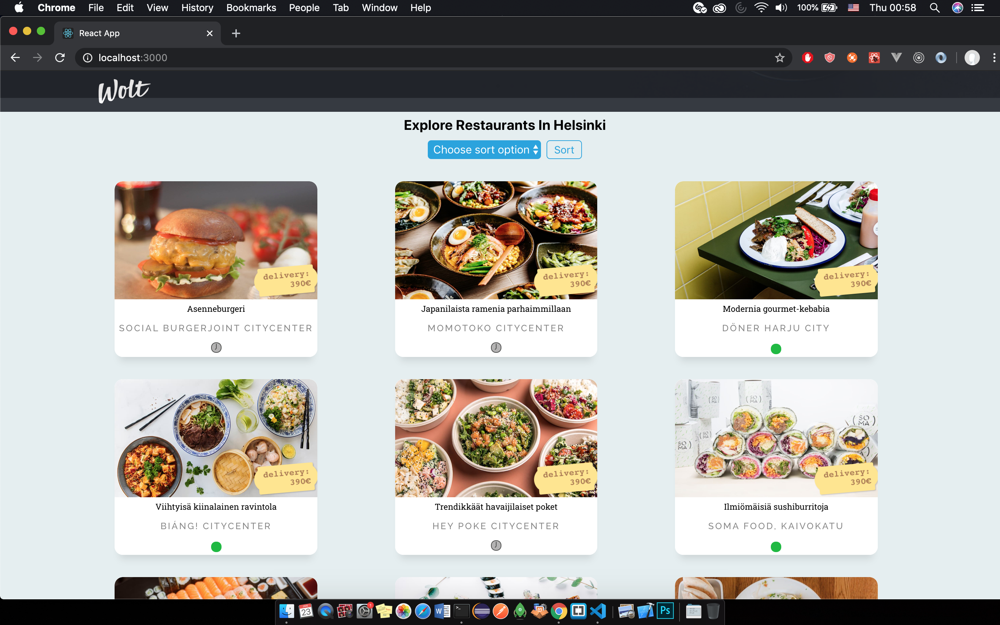
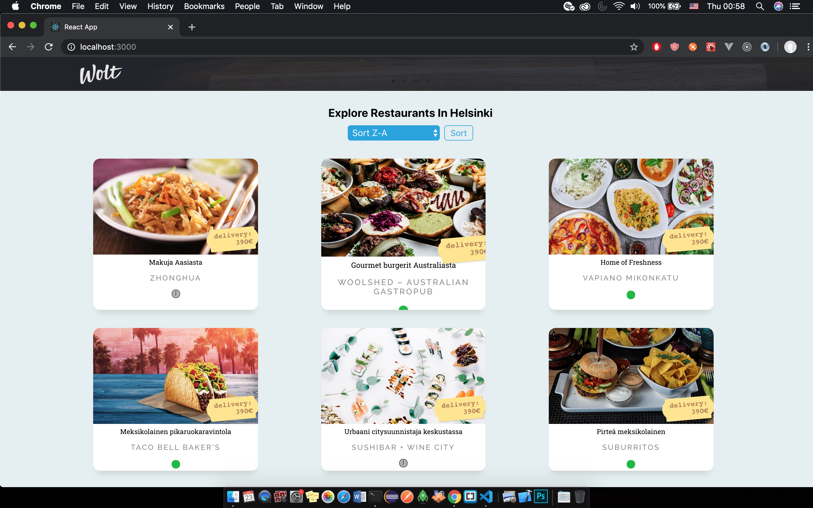
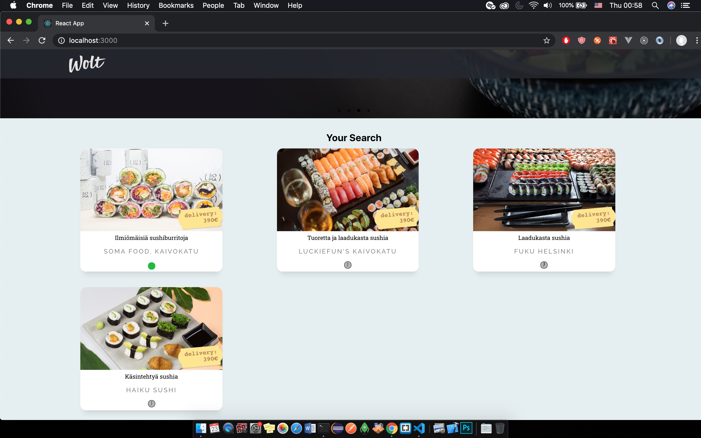

# Wolt's pre-assignment

Pre-Assignment applying for Wolt Internship. 

## Run Project

In the project directory (wolt_assignment_intern), you can run:

### `yarn install`

### `yarn start`

Runs the app in the development mode.

Open [http://localhost:3000](http://localhost:3000) to view it in the browser.

The page will reload if you make edits.

You will also see any lint errors in the console.

### Build with

React Hooks

### Details

Loading data and render data.

User can search for restaurants in search box with key-word ('sushi',..).

User can sort name alphabetically and reverse by choosing option from dropdown list and click button 'Sort'.

### Authors

Nhi Duong

### Demonstration
__Header__

__List All Items__

__Sorting from Z-A example__

__Search by name results__

